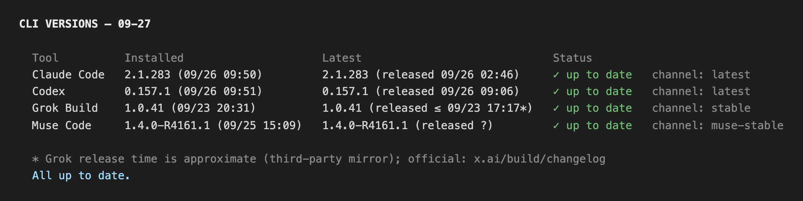

# Jeinn Agent Skills

Agent skills for Claude Code, Codex CLI, Grok Build, and anything else that reads the
`SKILL.md` convention. Nothing here depends on a particular host.

```bash
npx skills add Jeinn-co/agent-skills@ai-usage
npx skills add Jeinn-co/agent-skills@ai-cli-version
```

[Browse on skills.sh](https://skills.sh/jeinn-co/agent-skills) · 繁體中文：[README.zh-TW.md](README.zh-TW.md)

> Read the skill's own README first — it lists what must already be on your machine.

## Skills

| Skill | What it does | Docs |
|---|---|---|
| [`ai-usage`](skills/ai-usage/) | One report for how much of your Claude, ChatGPT, Grok and Muse subscription is left — percent used, when each window resets, what top-up you have, which model and effort each CLI is on now, and the CursorBench score, cost and CP of the model each CLI runs. | [README](skills/ai-usage/README.md) · [中文](skills/ai-usage/README.zh-TW.md) |
| [`ai-cli-version`](skills/ai-cli-version/) | Whether your Claude Code, Codex, Grok Build and Muse Code CLIs are up to date — installed version and when you installed it, latest version and when it was released. When updates are available, choose `y` to update all or `Esc` to skip. Tested on Windows and macOS; Linux not yet tested. | [README](skills/ai-cli-version/README.md) · [中文](skills/ai-cli-version/README.zh-TW.md) |


`/ai-cli-version` with all four CLIs up to date. When one is outdated, the report ends
with a `y` / `Esc` update prompt:



## Install

The `npx` method requires Node.js and npm. Check them before installing:

```bash
node --version
npx --version
```

The current `skills` CLI declares Node.js 22.20 or newer. If that is not available,
use the manual-copy method below; the skill itself does not require Node.js at runtime.

```bash
npx skills add Jeinn-co/agent-skills@ai-usage           # one skill
npx skills add Jeinn-co/agent-skills@ai-cli-version     # one skill
npx skills add Jeinn-co/agent-skills                    # everything in the repo
```

Or copy a skill directory into your agent's skills folder — `~/.claude/skills/`,
`~/.codex/skills/`, `~/.grok/skills/`.

**Read the skill's own README before installing** — each one lists what must already be
on your machine. Installing copies only that skill's directory, so its README travels
with it and this page does not.

If a newly installed skill is not visible immediately, start a new conversation or
restart the agent so it reloads its skill list.

## Update

Updates are not automatic. Installs made with `npx skills add` record their GitHub
source, so users can refresh them after a release:

```bash
npx skills update ai-usage -g -y          # global install
npx skills update ai-cli-version -g -y    # global install
npx skills update ai-usage -p -y          # project install (same for ai-cli-version)
```

Open a new conversation or restart the agent after updating so it reloads the skill.
Manually copied skills are not tracked; copy the directory again to update them.

## Test

Run the regression suite from the repository root:

```bash
python3 -m unittest -v tests/test_ai_usage_regressions.py
```

## Conventions

- **English is canonical.** A `.zh-TW.md` beside a doc is a mirror; when one changes,
  the other changes in the same commit.
- **Docs live with the skill.** Anything a user needs after installing goes inside
  `skills/<name>/`, not here. This page is an index.
- **Versions are by hand.** `SKILL.md` frontmatter carries `metadata.version`; the skill
  also prints its version so an installed copy can identify itself. The value is
  informational: `npx skills` tracks its own installs by source and content hash, while
  manually copied skills have no update record.

## License

MIT
