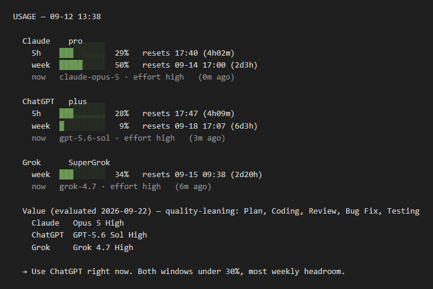
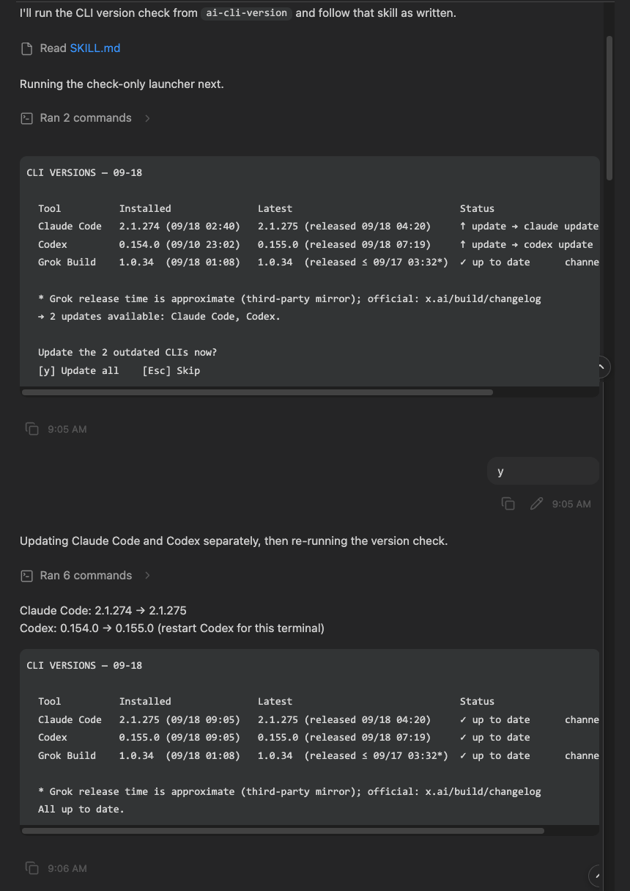

# Jeinn Agent Skills

> 中文版。英文版 [README.md](README.md) 為準，本檔為對照翻譯，兩邊同步更新。

給 Claude Code、Codex CLI、Grok Build，以及任何讀 `SKILL.md` 慣例的 agent 使用的
skills。內容不綁定任何特定 host。

```bash
npx skills add Jeinn-co/agent-skills@ai-usage
npx skills add Jeinn-co/agent-skills@ai-cli-version
```

[在 skills.sh 上瀏覽](https://skills.sh/jeinn-co/agent-skills) · English: [README.md](README.md)

> 安裝前請先讀該 skill 自己的 README —— 裡面列出你機器上需要先有什麼。

## Skills

| Skill | 做什麼 | 說明文件 |
|---|---|---|
| [`ai-usage`](skills/ai-usage/) | 一份報表看完 Claude、ChatGPT、Grok、Muse 四邊訂閱還剩多少 —— 用掉幾 %、各視窗何時重置、還有多少加購額度，以及每個 CLI 目前的 model 與 effort、以及那個 model 在 CursorBench 的分數、成本與 CP。 | [English](skills/ai-usage/README.md) · [中文](skills/ai-usage/README.zh-TW.md) |
| [`ai-cli-version`](skills/ai-cli-version/) | 你的 Claude Code、Codex、Grok Build、Muse Code CLI 是不是最新版 —— 目前版本和安裝時間、最新版本和發佈時間。有更新時，可選 `y` 全部更新或 `Esc` 跳過。目前已在 Windows 與 macOS 測試，Linux 尚未測試。 | [English](skills/ai-cli-version/README.md) · [中文](skills/ai-cli-version/README.zh-TW.md) |



`/ai-cli-version` 在 Claude Code 裡執行，含按 `y` 更新的流程：



## 安裝

用 `npx` 安裝需要 Node.js 與 npm。安裝前先確認：

```bash
node --version
npx --version
```

目前的 `skills` CLI 宣告需要 Node.js 22.20 以上。如果環境沒有這個版本，請改用下方的
手動複製方式；skill 執行時本身不需要 Node.js。

```bash
npx skills add Jeinn-co/agent-skills@ai-usage           # 只裝一個 skill
npx skills add Jeinn-co/agent-skills@ai-cli-version     # 只裝一個 skill
npx skills add Jeinn-co/agent-skills                    # 裝整個 repo
```

或是直接把 skill 目錄複製到你的 agent skills 資料夾 —— `~/.claude/skills/`、
`~/.codex/skills/`、`~/.grok/skills/`。

**安裝前請先讀該 skill 自己的 README** —— 每個 skill 都列出了它需要你機器上先有什麼。
安裝時只會複製該 skill 的目錄，所以它的 README 會跟著走，而這一頁不會。

如果剛安裝的 skill 沒有立刻出現，請開新對話或重新啟動 agent，讓它重新載入 skill 清單。

## 更新

更新不會自動發生。透過 `npx skills add` 安裝時會記錄 GitHub 來源，發布新版後可執行：

```bash
npx skills update ai-usage -g -y          # global 安裝
npx skills update ai-cli-version -g -y    # global 安裝
npx skills update ai-usage -p -y          # project 安裝（ai-cli-version 同理）
```

更新後請開新對話或重新啟動 agent，讓它重新載入 skill。手動複製的 skill 不會被追蹤；
需要再次複製目錄才能更新。

## 測試

在 repository 根目錄執行回歸測試：

```bash
python3 -m unittest -v tests/test_ai_usage_regressions.py
```

## 慣例

- **英文為準。** 文件旁邊的 `.zh-TW.md` 是鏡像；一邊改動，另一邊在同一個 commit 裡跟著改。
- **說明跟著 skill 走。** 使用者裝完之後會需要的內容，一律放在 `skills/<name>/` 裡面，
  不放在這裡。這一頁只是索引。
- **版本靠手動維護。** `SKILL.md` frontmatter 裡有 `metadata.version`，skill 執行時也會
  印出自己的版本，讓已安裝的副本能自報身分。這個值只供辨識：`npx skills` 會用來源與
  內容 hash 追蹤它安裝的 skill；手動複製的版本則沒有更新紀錄。

## 授權

MIT
