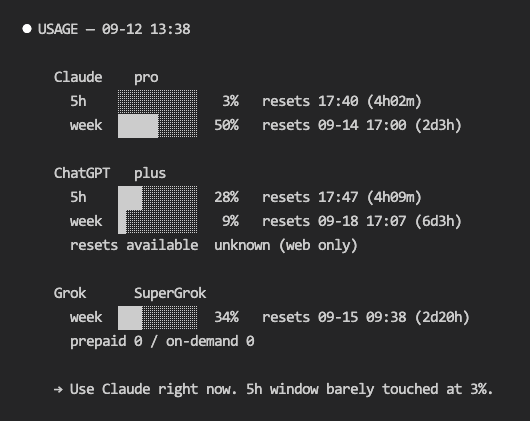
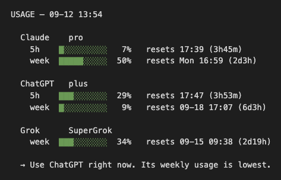
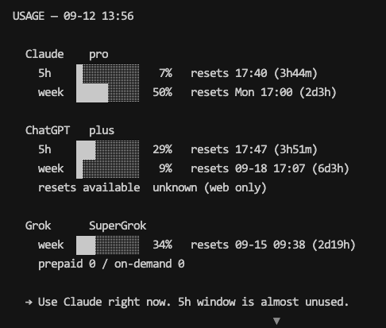

# ai-usage

> 中文版。英文版 [README.md](README.md) 為準，本檔為對照翻譯，兩邊同步更新。

一份報表看完 Claude、ChatGPT、Grok 三邊訂閱還剩多少 —— 用掉幾 %、各視窗何時重置、
還有多少加購額度。

可在 Claude Code、Codex CLI、Grok Build，以及任何讀 `SKILL.md` 慣例的 agent 使用，
不綁定特定 host。

## 安裝前必讀

先看這段 —— 這個 skill 只會**回報**這些工具的用量，不會幫你安裝它們。

### 1. Python 3.9 以上

只用標準函式庫，不需要 `pip install`，不需要虛擬環境。

```bash
python --version     # 或: python3 --version   /   py --version  (Windows)
```

`run.py` 會用**啟動它的那個直譯器**（`sys.executable`）去跑三個 probe，所以上面哪個
名字在你機器上能動，哪個就是對的。Windows 上請特別避開 `python3` 這個別名：它常常是
Microsoft Store 的 stub，執行後會跳出商店頁面而不是跑程式。

### 2. 至少一個 provider CLI，而且已經登入

| Provider | CLI | 怎麼登入 |
|---|---|---|
| Claude | `claude` | 先跑 `claude`，再輸入 `/login` |
| ChatGPT | `codex` | `codex login` |
| Grok | `grok` | 先跑 `grok`，依提示完成認證 |

**三個不必裝滿。** 裝一個就有一列，其他印 `not installed`，不會因此壞掉。這個 skill
不會要求你登入、不會開瀏覽器、不會讀任何已存的憑證 —— 它問的是每個 CLI 自己的本機
agent server，所以「裝了但沒登入」的 CLI 會回報呼叫失敗，而不是彈出登入畫面。

### 3. 網路與 subprocess 權限

Agent host 必須允許這個 skill 啟動本機 subprocess。每個 provider CLI 也必須能連上自己的
網路服務。Python 程式不會直接發送 HTTP request；認證與網路連線都留在 provider CLI
內部處理。

### 4. 平台

macOS、Linux、Windows 都支援 —— 但請看[限制與已知問題](#限制與已知問題)。啟動程式與
`portable.py` 已處理 Store stub 的 `python3`、`CreateProcess` 不吃的 npm `.cmd` shim，
以及 cp950/cp1252 stdout；2026-09-14 已在一台繁中 Windows 11 機器上實測跑通。

### 5. 不需要什麼

不需要 API key。不需要你已付費訂閱以外的任何帳號。不需要安裝 Python package：skill
只使用標準函式庫。

## 安裝

用 `npx` 安裝需要 Node.js 與 npm。這個版本發布時，`skills` CLI 1.5.26 宣告需要
Node.js 22.20 以上：

```bash
node --version
npx --version
```

如果環境不符合，請改用下方的手動複製方式；skill 執行時不需要 Node.js。

```bash
npx skills add Jeinn-co/agent-skills@ai-usage     # 只裝這一個 skill
npx skills add Jeinn-co/agent-skills              # 裝整個 repo
```

或是直接把 skill 目錄複製到你的 agent skills 資料夾 —— `~/.claude/skills/`、
`~/.codex/skills/`、`~/.grok/skills/`。

Windows 上請用複製，不要用連結；真的要連結就用 junction（`mklink /J`），它不需要提升
權限。**絕對不要把 symlink commit 進這個 repo** —— Git for Windows 會把它 checkout 成
一個內容是路徑字串的純文字檔，skill 會無聲無息地失效。

如果安裝後沒有立刻看到 `/ai-usage`，請開新對話或重新啟動 agent，讓它重新載入 skill 清單。

## 更新

更新不會自動發生。透過 `npx skills add` 安裝時會記錄 GitHub 來源，發布新版後可直接更新：

```bash
npx skills update ai-usage -g -y    # global 安裝
npx skills update ai-usage -p -y    # project 安裝
```

更新後請開新對話或重新啟動 agent，讓它重新載入 skill。手動複製的 skill 不會被追蹤；
需要再次複製目錄才能更新。

## 使用

把 skill 名稱當 slash command 打：

    /ai-usage

介面就只有這樣。它每次都讀即時資料，沒有快取要清，也沒有 refresh flag 要記。如果要
不透過 agent 直接執行，先切換到已安裝的 `ai-usage` 目錄，再使用對應平台的啟動方式：

```bash
./run.sh          # macOS 或 Linux
py -3 run.py      # Windows；如果沒有 `py`，改用 `python run.py`
```

在對應平台指令後加 `--version`，就會只印出 skill 版本後結束。

## 輸出長什麼樣

同一個 `/ai-usage` 指令，在二十分鐘內分別於三個不同的 agent 裡執行：

**Claude Code**



**Codex CLI**



**Grok CLI**



它問的是各 provider 自己的 CLI，不是它所在的 host，所以不論裝在哪個 host，都會讀取相同
的 provider 帳號資料 —— 在 Codex 裡面跑，一樣拿得到 Claude 和 Grok 的數字。

純文字版：

```
USAGE — 09-12 01:08

  Claude    pro
    5h    ███░░░░░░░  29%   resets 03:40 (2h32m)
    week  ████░░░░░░  41%   resets Mon 17:00 (2d16h)

  ChatGPT   plus
    5h    ░░░░░░░░░░   0%   resets 05:55 (4h47m)
    week  ░░░░░░░░░░   0%   resets 09-18 17:07 (6d15h)

  Grok      SuperGrok
    week  ███░░░░░░░  27%   resets 09-15 09:38 (3d8h)

  → Use ChatGPT right now. Both windows are fresh.
```

**三個數字全部是即時的。** 沒有爬任何網頁，沒有驅動瀏覽器，沒有讀任何已存憑證。是直接
問各家自己的 CLI：

| Provider | 方法 |
|---|---|
| Claude | `claude -p "/usage"` —— print 模式會把內建的 slash command 導進來 |
| ChatGPT | `codex app-server` → JSON-RPC `account/rateLimits/read` |
| Grok | `grok agent stdio` → ACP 擴充方法 `_x.ai/billing` |

CLI 沒安裝的 provider 會回報 `not installed`，其他照跑。需要 Python 3.9+，無相依套件。

有兩項是**刻意不回報**的，因為本機讀不到，而報一個錯的數字比不報更糟：

- **ChatGPT 的「Usage limit resets」** —— app-server 可以花掉一次
  （`account/rateLimitResetCredit/consume`），但沒有任何方法可以「讀」剩幾次。全部 163
  個方法都查過了。報表直接省略這一行，不印 `unknown`。`credits.balance` 是另一個池子，
  不能拿來替代。
- **Claude 的 extra usage** —— 目前 CLI 回應沒有可靠的對應欄位。
  `fast_mode_disabled_reason` 描述的是 fast mode，不是 extra usage。

每個方法是怎麼找到的（包含走過的死路，讓後人不用再走一次），見 [`references/providers.md`](references/providers.md)。

## 限制與已知問題

**平台。** 在 macOS 上開發並驗證過。Linux 未經測試，但走的是同一條 code path。
**Windows 已於 2026-09-14 驗證** —— 在一台繁中 Windows 11 機器（PowerShell、
Python 3.12）上實測跑通。啟動程式與 `portable.py` 處理了 Store stub 的
`python3`、`CreateProcess` 不吃的 `.cmd` shim，以及*自己*輸出用的 cp950/cp1252
stdout。這次實測也抓到一個這段文字之前沒提到的 bug：`subprocess` 的
`text=True` 是用作業系統 locale 編碼去解碼**被啟動的 CLI**的輸出，不是 UTF-8，
導致 Claude 的用量那行在 cp950 下丟出 `UnicodeDecodeError`。已透過
`portable.text_kwargs()` 固定 `encoding="utf-8"` 修好（三個 probe 都套用）。
目前只在一台機器、一種非英文 locale 測過，其他 locale 或 Windows 版本仍可能
踩到新問題。歡迎回報 Windows 上的 bug，回報內容的可信度高於這段文字。

**版本綁定。** 2026-09-12 針對 `claude` 2.1.268、`codex` 0.154.0、`grok` 1.0.25 驗證。

| 風險 | 位置 | 壞掉時會怎樣 |
|---|---|---|
| Claude 那兩行用量是自由文字，靠 regex 解析 | `claude_usage.py` | 退回直接印原始那行；絕不會印出錯的數字 |
| Codex 的 app-server 協定是 OpenAI 私有的，沒有任何相容性承諾 | `codex_usage.py` | 方法改名或必要欄位缺失時，ChatGPT 那列會明確失敗；絕不預設成 0% |
| Grok 的 `_x.ai/billing` 是廠商自訂的 ACP 擴充，不屬於 ACP 規格 | `grok_usage.py` | 方法改名或必要欄位缺失時，Grok 那列會明確失敗；絕不預設成 0% |

**刻意不回報的。** 這裡報錯數字比不報更糟：

- **ChatGPT 的「Usage limit resets」**（設定頁顯示 `Available N`）讀不到。app-server
  可以透過 `account/rateLimitResetCredit/consume` *花掉* 一次，但沒有計數的方法 ——
  163 個方法全查過了。報表直接省略這一行，不印 `unknown`。`credits.balance` 是另一個
  池子：帳號可能顯示 `balance 0` 但手上還有 2 次 reset，所以絕不拿它替代。
- **Claude 的 extra usage** 不回報。目前 CLI 回應沒有可靠的對應欄位；
  `fast_mode_disabled_reason` 明確描述的是 fast mode。
- **Grok 只有一個視窗，不是兩個。** 不會幫它捏造一個 5 小時的列。

**數字是帳號層級，不是機器層級。** Claude 的 `/usage` 註明它的細項是近似值、且只涵蓋
本機的 session；但最上層那幾個百分比是整個帳號的。

## 授權

MIT
